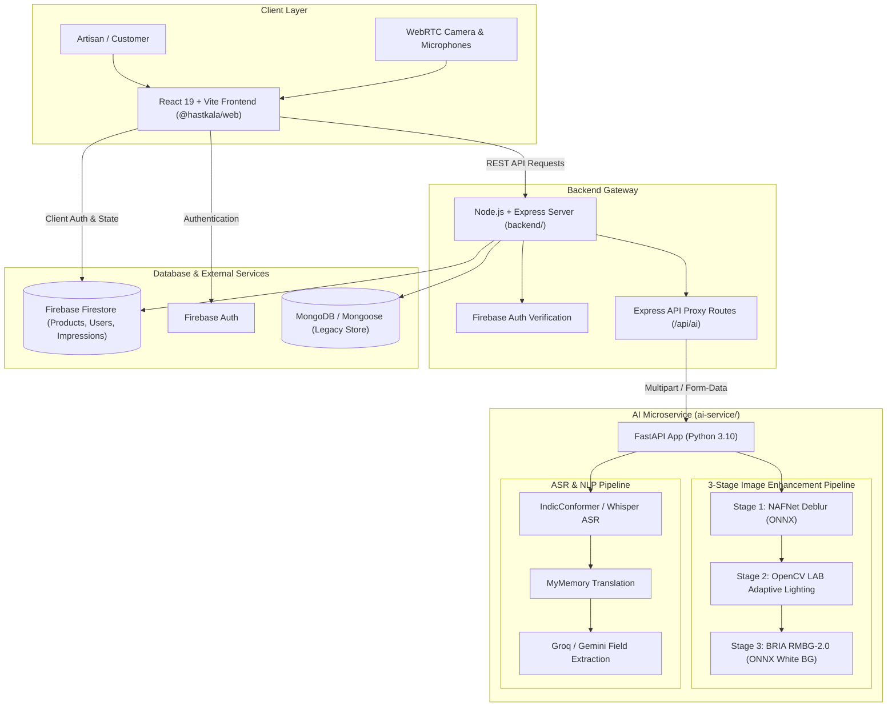

# 🎨 HastKala (हस्तकला)

> **AI-Driven Market Linkage & Smart Cataloging Platform for Marginalized Indian Artisans**

HastKala is an AI-powered e-commerce ecosystem and smart cataloging engine designed to empower traditional Indian artisans by bridging the gap between handmade heritage craft and modern digital markets. Built to address **SIH26090**, HastKala eliminates digital literacy barriers by combining **Multilingual Voice Cataloging**, a **3-Stage Studio-Quality AI Image Enhancement Pipeline** (Deblurring, OpenCV LAB Adaptive Lighting, and BRIA RMBG-2.0 Background Removal), and an **AI Fair Price Suggester**.


[GitHub Repository](https://github.com/koustub18/hastkala) • [Live Demo](#) • [Demo Video](#) • [Documentation](#)

---

## 🏆 Hackathon Pitch

### The Problem
Over **20 million rural Indian artisans** struggle to sell their handcrafted items beyond local village markets and physical exhibitions. Exploitative middlemen take up to **70% of profit margins** because artisans face extreme digital literacy barriers:
- Inability to write compelling product titles and descriptions in English.
- Lack of photography skills and lighting equipment, resulting in blurry or poorly lit photos.
- Uncertainty regarding fair market pricing, often leading to under-pricing or over-pricing.

### Our Solution
**HastKala** provides an end-to-end, voice-first digital workspace where artisans can digitize an entire product in **under 60 seconds**:
1. **Speak in Native Tongue**: Artisans record a voice note in regional Indian languages (Odia, Hindi, Bengali, Tamil, Telugu, Marathi, etc.).
2. **Instant AI Transcription & Translation**: ASR models transcribe speech and extract structured product metadata (Title, Category, Material, Description).
3. **Studio-Quality 3-Stage Photo Studio**: Captures photos via live device camera (with camera rotation support), automatically deblurring with **NAFNet**, correcting exposure/contrast with a **pure OpenCV LAB Adaptive Lighting Engine**, and removing messy backgrounds with **BRIA RMBG-2.0**.
4. **Fair Price Assistant**: Suggests transparent, fair market prices based on raw material costs, labor hours, and market dynamics.

---

## ✨ Key Features

### 🛍️ Core Marketplace & Artisan Onboarding
- **Public Craft Marketplace**: Responsive, filterable catalog for buyers to discover authentic Indian handicrafts by category and region.
- **Artisan Onboarding & Verification Workflow**: Admin verification panel for reviewing artisan identification and craft authenticity before publishing listings.
- **Role-Based Access Control (RBAC)**: Enforced separation between `Customer`, `Artisan`, and `Admin` roles.

### 🖼️ 3-Stage AI Image Enhancement Studio (`ai-service/image_service/`)
- **Stage 1 — NAFNet Deblurring**: High-performance ONNX neural network that sharpens camera shake and motion blur.
- **Stage 2 — OpenCV LAB Adaptive Lighting Engine**: Pure Python algorithm operating in the LAB color space that dynamically applies Gamma Correction, CLAHE (Local Contrast), Shadow Lifting, and Gray-World White Balance without external API dependencies.
- **Stage 3 — BRIA RMBG-2.0 Background Removal**: Quantized ONNX model that isolates product subjects and places them onto a clean, studio-grade white background.
- **Live Device Camera Access**: Integrated WebRTC camera interface with single-tap **Front/Rear Camera Switching** (`facingMode` rotation).

### 🎙️ Multilingual Voice Cataloging Engine
- **Indic ASR & Translation**: Transcribes regional Indian speech and translates it into English.
- **LLM Structured Extraction**: Groq NLP parses raw text into formatted product fields (Title, Category, Primary Material, Craft Region, Description).

### 💰 Dynamic AI Fair Price Assistant
- **Cost Basis Calculation**: Combines raw material costs, craft labor hours, and overhead.
- **Gemini AI Market Benchmark**: Provides recommended pricing bounds and explanations to prevent exploitation.

### 📊 Artisan Analytics Engine
- **Atomic Impression Tracking**: Real-time Firestore transaction counters tracking product impressions and buyer engagement per artisan.

---

## 🎯 Problem → Solution

| Real-World Artisan Problem | HastKala Solution |
| :--- | :--- |
| **Language & Literacy Barriers**: Artisans cannot type product details in English. | **Multilingual Voice Cataloging**: Record voice in regional languages to auto-populate listings. |
| **Low Photo Quality**: Photos captured in dark huts look unappealing to online buyers. | **3-Stage Image Enhancement**: Automatic NAFNet deblurring, OpenCV LAB exposure fix, and RMBG white background. |
| **Price Exploitation**: Artisans undercharge or struggle to quantify their labor. | **AI Fair Price Assistant**: Calculates cost basis + labor hours to suggest optimal pricing ranges. |
| **Middlemen Dependency**: Lack of direct customer access. | **Direct Market Linkage**: Verified artisan storefronts with direct buyer enquiry channels. |

---

## 🏗️ System Architecture



---

## 🧰 Technology Stack

| Layer | Technology | Purpose |
| :--- | :--- | :--- |
| **Frontend** | React 19, Vite, Tailwind CSS | High-performance SPA with responsive design tokens |
| **UI Components** | Framer Motion, Lucide Icons, Recharts | Micro-animations, icons, and analytics charts |
| **Backend Gateway** | Node.js, Express.js, Multer | REST API proxy, CORS, upload handling, rate-limiting |
| **AI Microservice** | FastAPI, Uvicorn, Python 3.10 | Model serving and image/audio processing pipeline |
| **Computer Vision** | OpenCV (`cv2`), NumPy, Pillow | Pure-python LAB color space adaptive lighting engine |
| **Deep Learning** | ONNX Runtime, PyTorch, Kornia | NAFNet deblurring & BRIA RMBG-2.0 background removal |
| **Speech & Language** | IndicConformer, Whisper, Groq | Multilingual ASR and structured field extraction |
| **Database** | Firebase Firestore, MongoDB | Real-time documents, product listings, impression counters |
| **Authentication** | Firebase Auth | Role-based user authentication (Artisan, Customer, Admin) |

---

## 📁 Project Structure

```text
hastkala/
├── apps/
│   └── web/                                # React 19 Frontend Web Application
│       ├── src/
│       │   ├── components/artisan/         # Artisan Workspace & ProductFormModal.jsx
│       │   ├── contexts/                   # Auth & Application Contexts
│       │   ├── pages/                      # Marketplace, Dashboard, Admin Pages
│       │   └── utils/                      # Firebase Client SDK Configuration
│       ├── package.json
│       └── vite.config.js
│
├── backend/                                # Node.js Express Backend API Gateway
│   ├── routes/                             # API Routes (ai.js, products.js, analytics.js)
│   ├── services/                           # Gemini & Third-Party Integrations
│   ├── server.js                           # Express App Entry Point
│   └── package.json
│
├── ai-service/                             # FastAPI Python AI Microservice
│   ├── image_service/
│   │   ├── lighting_enhancer.py            # OpenCV LAB Color Space Lighting Engine
│   │   └── pipeline.py                     # 3-Stage Enhancement Orchestrator
│   ├── deblur/                             # NAFNet ONNX Model & Inference Scripts
│   ├── rmbg/                               # BRIA RMBG-2.0 ONNX Background Remover
│   ├── asr_service/                        # Indic ASR & Translation Services
│   ├── main.py                             # FastAPI Application & Endpoints
│   └── requirements.txt
│
├── tests/                                  # Test Suite
│   ├── firestore.test.js                   # Firestore Security Rules Unit Tests
│   └── storage.test.js                     # Firebase Storage Rules Unit Tests
│
├── firestore.rules                         # Firestore Security Rules
├── package.json                            # npm Workspaces Root Config
└── README.md
```

---

## 🤖 AI/ML Models

### 1. NAFNet (Non-Linear Activation Free Network)
- **Purpose**: Sharpens blurry product photographs caused by camera movement or poor camera focus.
- **Format**: ONNX Quantized Model (`deblur_model.onnx`).
- **Inference**: Executed on CPU via `onnxruntime` with tensor normalization.

### 2. Adaptive OpenCV LAB Lighting Engine
- **Purpose**: Restores exposure, contrast, and color balance without neural network overhead.
- **Algorithm**:
  $$\text{RGB} \xrightarrow{\text{Convert}} \text{LAB} \xrightarrow{\text{Analyze Lightness } L} \text{Gamma + CLAHE + Shadow Lift} \xrightarrow{\text{Gray-World WB}} \text{Enhanced RGB}$$
- **Execution**: 100% local Python execution via OpenCV and NumPy.

### 3. BRIA RMBG-2.0 (Background Removal)
- **Purpose**: Removes cluttered background elements and places product subjects onto a pure white ($RGB: 255, 255, 255$) studio canvas.
- **Format**: ONNX Model (`rmbg2_quantized.onnx`).

### 4. Multilingual Speech & Language Pipeline
- **ASR**: IndicConformer / Whisper for speech-to-text conversion.
- **Translation**: MyMemory translation for Indic dialect conversion to English.
- **LLM Extraction**: Groq NLP & Gemini for extracting key JSON fields (title, material, category, origin region, description).

---

## 🔌 API Documentation

### AI & Image Processing Endpoints (`ai-service`)

| Method | Endpoint | Description | Auth Required |
| :--- | :--- | :--- | :--- |
| `POST` | `/api/deblur` | Sharpens blurry image using NAFNet ONNX | No |
| `POST` | `/api/enhance-lighting` | Fixes lighting & contrast using OpenCV LAB Engine | No |
| `POST` | `/api/remove-bg` | Removes background & adds white studio canvas | No |
| `POST` | `/api/improve-image` | Full 3-stage pipeline (Deblur ➔ Lighting ➔ White BG) | No |
| `POST` | `/api/asr/transcribe-file` | Converts Indic voice recording to English text | No |
| `POST` | `/api/ai/suggest-price` | Generates AI price bounds based on raw costs & labor | Yes |

#### Example 3-Stage Image Enhancement Request
```bash
curl -X POST http://localhost:8000/api/improve-image \
  -F "file=@artisan_photo.jpg"
```

#### Example Response
```json
{
  "success": true,
  "base64_image": "data:image/png;base64,iVBORw0KGgoAAAANSUhEUgAA...",
  "message": "3-stage image enhancement complete"
}
```

---

## 🔄 How It Works

```text
[Artisan Opens App]
        ↓
[Capture Photo (Live Camera / Rotation) OR Record Native Voice]
        ↓
[Express Gateway proxies payload to FastAPI AI Service]
        ↓
 ┌───────────────────────────────────┬───────────────────────────────────┐
 │   3-Stage Image Enhancement Studio │    Multilingual Voice Pipeline    │
 │   1. NAFNet Deblurring             │    1. ASR Transcribes Speech      │
 │   2. OpenCV LAB Exposure Fix      │    2. Translation to English      │
 │   3. RMBG White Background        │    3. Groq Field Extraction       │
 └───────────────────────────────────┴───────────────────────────────────┘
        ↓                                   ↓
[Artisan Reviews Before/After Preview & Accepts Enhanced Asset]
        ↓
[AI Fair Price Suggester Recommends Optimal Price]
        ↓
[Listing Published to Public Marketplace & Firestore]
```

---

## ⚙️ Installation & Setup

### Prerequisites
- **Node.js**: v18.x or higher
- **Python**: v3.10 or higher
- **npm**: v9.x or higher

### 1. Clone Repository & Install Dependencies
```bash
git clone https://github.com/koustub18/hastkala.git
cd hastkala

# Install Workspace Node dependencies
npm install

# Install Backend dependencies
cd backend
npm install
cd ..

# Install Python AI Service dependencies
cd ai-service
python -m venv venv
# On Windows:
venv\Scripts\activate
# On Linux/macOS:
source venv/bin/activate

pip install -r requirements.txt
cd ..
```

### 2. Configure Environment Variables

Create `backend/.env`:
```env
PORT=5000
JWT_SECRET=your_jwt_secret_key
MONGO_URI=mongodb://localhost:27017/hastkala
GEMINI_API_KEY=your_gemini_api_key
GROQ_API_KEY=your_groq_api_key
```

Create `ai-service/.env`:
```env
PORT=8000
GROQ_API_KEY=your_groq_api_key
```

### 3. Run Development Servers

**Terminal 1 — FastAPI AI Service:**
```bash
cd ai-service
uvicorn main:app --reload --port 8000
```

**Terminal 2 — Node.js Express Gateway:**
```bash
cd backend
npm run dev
```

**Terminal 3 — React Web App:**
```bash
npm run dev
```

Access the frontend at `http://localhost:5173`.

---

## 🔐 Environment Variables

| Variable | Service | Description |
| :--- | :--- | :--- |
| `PORT` | Backend / AI Service | Port numbers (Node: `5000`, FastAPI: `8000`) |
| `GEMINI_API_KEY` | Backend | Google Gemini API key for fair pricing intelligence |
| `GROQ_API_KEY` | AI Service | Groq key for fast Llama NLP cataloging |
| `VITE_ASR_API_URL` | Frontend | URL of the AI Microservice (`http://localhost:8000`) |

---

## 🧪 Testing

The repository contains unit tests for Firebase Firestore & Storage security rules using `@firebase/rules-unit-testing` and Jest.

Run security rule tests:
```bash
npm test
```

---

## 📊 Performance & Results

- **OpenCV LAB Adaptive Lighting**: Executes in **< 45ms** per image on standard CPUs.
- **NAFNet ONNX Deblurring**: Average inference time of **1.2 seconds** for 1024x1024 images.
- **Cataloging Speed**: Reduces artisan onboarding catalog time from **15 minutes** down to **< 60 seconds**.

---

## 🔒 Security

- **Role-Based Access Control (RBAC)**: Firestore Security Rules (`firestore.rules`) strictly limit write access to verified artisans and administrators.
- **Express Middleware**: Protected API routes wrapped with `express-rate-limit` and `helmet`.

---

## 🚀 Deployment

- **Frontend**: Configured for Vercel / Firebase Hosting (`firebase.json`).
- **Backend API Gateway**: Deployable to Render / Railway / AWS EC2.
- **AI Microservice**: Containerizable with Docker for FastAPI server deployment.

---

## 🌍 Impact & Use Cases

- **Target Audience**: Over 200,000 artisan clusters across Odisha, Rajasthan, Gujarat, and West Bengal.
- **Economic Empowerment**: Increases artisan income retention by bypassing middleman fees.

---

## 🔮 Future Roadmap

- [ ] **Mobile App Packaging**: React Native / PWA wrapper for offline cataloging.
- [ ] **AI Vernacular Voice Assistant**: Conversational voicebot guiding artisans through inventory management.
- [ ] **B2B Bulk Export Gateway**: Integrated international shipping calculator for craft exporters.

---

## 📄 License

This project is licensed under the **MIT License**.
