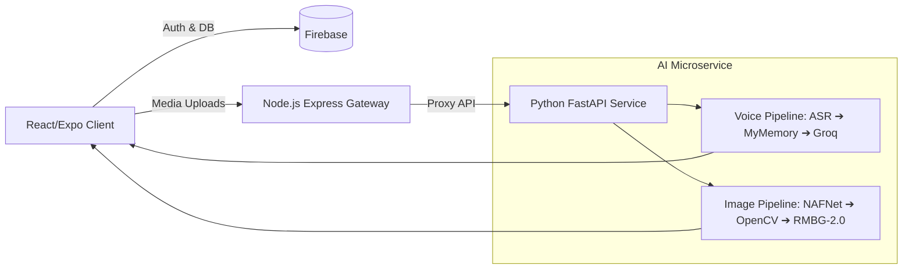

# 🎨 HastKala (हस्तकला)

> **AI-Driven Market Linkage & Smart Cataloging Platform for Marginalized Indian Artisans**

HastKala empowers traditional Indian artisans by providing a voice-first digital workspace, an AI photo studio, and a fair-price suggester, instantly bridging the gap between handmade heritage crafts and modern digital markets.

---

## 🧰 Tech Stack

**Frontend:**
* React.js (Vite)
* Tailwind CSS
* Framer Motion & Lucide React
* React Router DOM

**Backend & Database:**
* Node.js & Express.js (API Gateway)
* Firebase (Firestore, Authentication, Cloud Storage)

**AI Microservice:**
* Python 3.10
* FastAPI & Uvicorn
* OpenCV (Computer Vision)
* PyTorch & ONNX Runtime

---

## 🤖 Models Used

* **BRIA RMBG-2.0 (ONNX):** AI Background removal to create studio-quality white canvases.
* **NAFNet (ONNX):** AI Image deblurring to fix camera shake and motion blur.
* **Custom PyTorch MLP:** AI Price Prediction for fair market suggestions.
* **OpenCV LAB Engine:** Adaptive lighting and contrast correction algorithm.
* **IndicConformer / Whisper:** Automatic Speech Recognition (ASR) for regional Indian languages.

---

## 🔌 APIs Used

* **Groq API (`llama-3.1-70b-versatile`):** NLP for extracting structured product metadata (Title, Material, Description) from raw voice text.
* **MyMemory API:** Translates regional Indian dialects into English/Hindi.
* **Google Gemini API:** AI Market Benchmarking for generating fair pricing bounds.

---

## 🏗️ System Architecture & Workflow

**Workflow:**
1. **Client Interaction:** Artisan/Buyer interacts with the React web interface.
2. **Auth & State:** Firebase handles all role-based authentication and NoSQL data storage (Firestore).
3. **Gateway Proxy:** Image and Voice uploads are routed through the Node.js/Express backend.
4. **AI Processing:** 
   * *Voice Cataloging:* FastAPI receives audio → ASR transcribes → MyMemory translates → Groq extracts JSON → Frontend populates form.
   * *Image Studio:* FastAPI receives image → NAFNet deblurs → OpenCV enhances lighting → RMBG-2.0 removes background → Returns enhanced image.

---

## ✨ Features & Unique Features

**Core Features:**
* Artisan Registration & Profile Management
* Buyer Marketplace with Category and Origin-State filtering
* Direct Artisan-to-Buyer connections
* Artisan Dashboard with Inventory Tracking
* Admin Verification Workflow for quality control

**Unique Features:**
* **Multilingual Voice-Driven Cataloging:** Allows artisans to list products entirely by speaking in their native language (zero typing required).
* **3-Stage AI Image Studio:** Automatically transforms poor-quality mobile photos into professional e-commerce shots (Deblur + Lighting + BG Remove).
* **AI Fair Price Assistant:** Suggests transparent market pricing based on materials, time, and craft type to prevent middleman exploitation.
